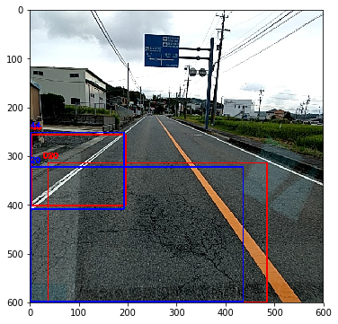
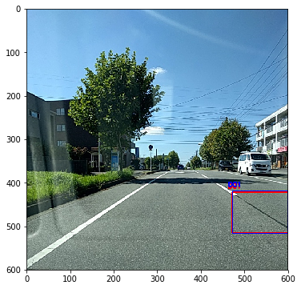
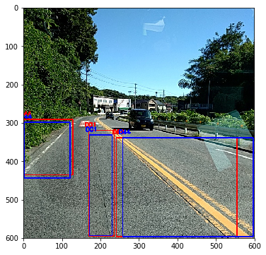
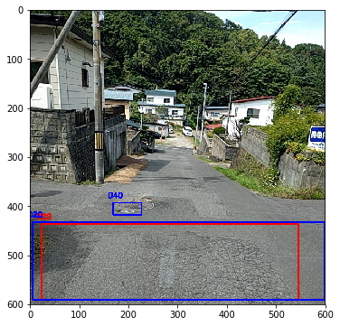

# road damage detection

This repository contains source code and trained models for [Road Damage Detection and Classification Challenge](https://bdc2018.mycityreport.net/overview/) that was held as one of the 2018 IEEE Big Data Cup.

The best model achieved mean F1-score of 0.6236 (**Ranked 3rd**) on test dataset of the competition.

Sample predictions (ground-truth boxes are blue, predicted boxes are red):

   

## Table of contents

- [Prerequisites](#prerequisites)
- [Quick start](#quick-start)
- [RDCC Dataset Setup](#RDCC-Dataset-Setup)
- [Detection / Submission](#Detection)
- [Training](#Training)
- [Citation](#Citation)

## Prerequisites

You need to install:
- [Python3](https://www.python.org/downloads/)
- [git lfs](https://git-lfs.github.com/)
- Use `requirements.txt` to install required python dependencies

    ```Shell
    # Python 3 is needed
    pip3 install -r requirements.txt
    ```
   

## Quick-start
1. Clone the road-damage-detection repo into $RDD: 

    ```Shell
    git clone https://github.com/dweeptrivedi/road-damage-detection.git
    ```

2. Install python packages:

    ```Shell
    pip3 install -r requirements.txt
    ```

3. Execute `./build_darknet.sh` to download and build Darknet for GPU (will be successful only if GPU support available) and CPU 


## RDCC Dataset Setup

1. Register at [RDDC](https://bdc2018.mycityreport.net/overview/) website to download competition dataset

2. Generate the label files for Darknet using [$RDD/src/xml2Yolo.py](https://github.com/dweeptrivedi/road-damage-detection/blob/master/src/xml2Yolo.py)
    - Use `python3 xml2Yolo.py --help` for command line option details

NOTE: It is expected that the Dataset be structured in PASCAL VOC format (images under JPEGImages, XML files under Annotations directory)


## Detection

- `test.txt` should contain list of image paths that needs road damage detection.

- run `python3 detector.py` for default network.

- Best combination for the Challenge:
    - `python3 detector.py --input-file="test.txt" --approach="one-phase" --yolo=45000 --nms=0.999 --thresh=0.01`
    - `python3 detector.py --input-file="test.txt" --approach="augmented" --yolo=60000 --nms=0.999 --thresh=0.0508`
    - `python3 detector.py --input-file="test.txt" --approach="cropped" --yolo=60000 --nms=0.999 --thresh=0.15`
    
- command-line option details:

| option |  possible values | default values | Notes |
| --- | --- | --- | --- |
| --input-file | location of the file | "test.txt" | contains list of image paths that needs detection. |
| --approach | ["one-phase", "cropped", "augmented"] | "one-phase" |name of the approach (as described in paper) |
| --yolo | int | 45000 | iteration number of Yolo weight file. I have uploaded one weight file (best performance on test dataset) for each approach  |
| --nms | float value in [0,1] | 0.45 | nms threshold value for dropping overlapping predictions |
| --thresh | float value in [0,1] | 0.1 | confidence threshold value for predictions |
| --gpu | boolean | False | whether to use GPU or not. Set this option only if `build_darknet.sh` returned successful build for GPU |

## Training

- Yolo: For training darknet53 network for road damage detection task:

    - `cd $RDD/train/darknet/`

1. Download pre-trained weights from official [YOLO](https://pjreddie.com/darknet/yolo/) website.

    - For darknet53 network use `wget https://pjreddie.com/media/files/darknet53.conv.74`

2. (optional) Augment data using [src/augmentation/augmentor.py](https://github.com/dweeptrivedi/road-damage-detection/blob/master/src/augmentation/augmentor.py)

3. Add `cfg/damage.data` file similar to `cfg/coco.data` but pointing to RDCC dataset in your system

4. Modify `cfg/yolov3.cfg` (model file) according to RDCC dataset

5. Execute:

    - `./darknet detector train cfg/damage.data cfg/yolov3.cfg darknet53.conv.74`

6. By default, trained networks are saved under:

    - `$RDD/train/darknet/backup/`

## Citation


